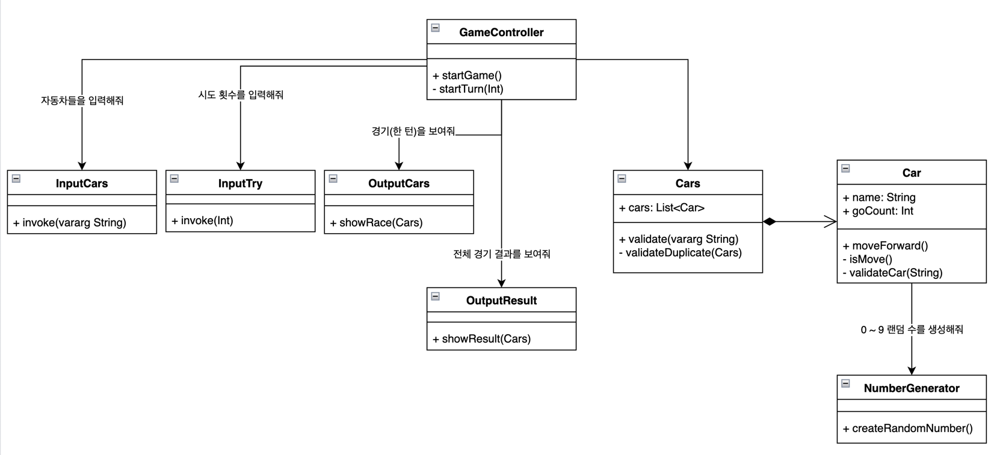

# 미션 - 자동차 경주

## 구현할 기능 목록

- [ ] 경주할 자동차 이름을 입력한다.  (`InputCars`)
  - [ ] 이 때 자동차 이름은 쉼표(,) 로 구분한다.
   
- [ ] 자동차 입력에 대한 유효성을 판단한다.(`Cars.validate`) 
  - [ ] 각 자동차 이름은 5글자 이하이다. (`Car.validateCar` )
  - [ ] 각 자동차에 중복이 있으면 안된다.(`Cars.validateDuplicate`)
- [ ] 시도할 횟수를 자연수로 입력한다.(`InputTry`)
  - [ ] 시도에 대한 유효성을 판단한다. 
- [ ] 자동차가 전진한다.(`Car.moveForward`)
  - [ ] 자동차의 전진은 '-' 로 표시한다.
  - [ ] 자동차들이 전진했을 때 모습은 아래처럼 출력한다. (`OutputResult.showRace`)
      ```
      pobi : --
      woni : ----
      jun : ---
      ```

- [ ] 전진 조건을 판별한다. 
  - [ ] 0에서 9 까지의 무작위 수를 구한다. (`NumberGenerator.createRandomNumber`)
  - [ ] 무작위 수가 4 이상인지 판별한다. (`Car.isMove`)
- [ ] 최종 우승자를 출력한다.(`OutputResult.showResult`)
  - [ ] 공동 우승자가 있다면 여러 우승자를 출력할 수 있다.





