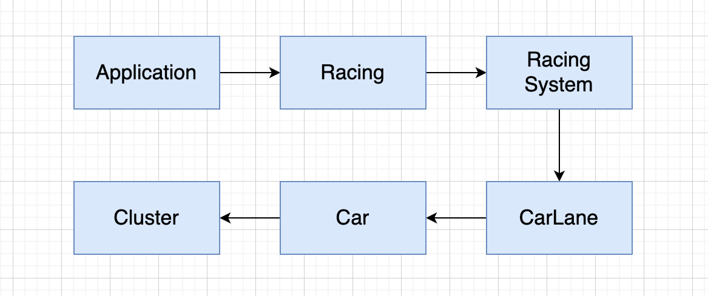

# 자동차 경주 기능 명세서  

## 🏆 레이싱(Racing)
- ✅ 레이싱 시작 전 자동차 이름과 시도횟수를 입력을 받는다.
- ✅ 레이싱을 시작한다.
- ✅ 레이싱 우승자를 발표한다.
## 🏁 레이싱 시스템(Racing System)
- ✅ 입력된 자동차 이름의 유효성을 검사한다.
- ✅ 입력된 시도 횟수의 유효성을 검사한다.
- ✅ 입력된 이름의 자동차들이 들어갈 자동차 레인을 생성한다.
- ✅ 시도횟수 만큼 달리는 경기를 시작할 수 있다.
- ✅ 자동차 레인을 통해 우승자를 발표한다.
## 🚥 자동차 레인(CarLane)
- ✅ 자동차들의 이동거리를 비교하여 우승자를 판단한다.
- ✅ 1번의 이동기회마다 모든 자동차를 랜덤하게 앞으로 이동시킨다.
- ✅ 1번의 이동기회마다 모든 자동차의 이동결과를 보여준다.
- ✅ 가장 멀리 간 이동거리를 도출한다.
## 🚗 자동차(Car)
- ✅ 0에서 9사이 무작위 값 중 4이상의 수가 뽑히면 앞으로 이동한다.
- ✅ 앞으로 이동한 거리를 측정한다.
- ✅ 이동할 때마다 계기판을 업데이트한다.
- ✅ 자동차 이름과 계기판을 보여준다.
## 📟  계기판(Cluster)
- ✅ 이동거리 그림을 그린다

## 클래스 의존 관계
- 밑의 그림과 같은 클래스 의존성을 갖고 있다.

